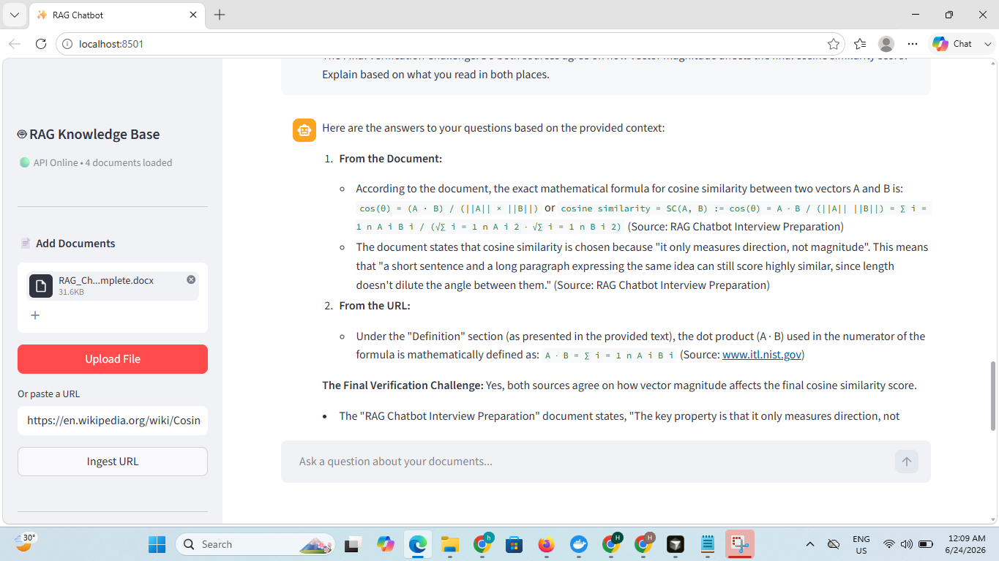

# 📚 Marginal — Multi-Format RAG Chatbot

Upload a PDF, Word document, CSV, or paste a webpage link — then ask questions about it and get answers grounded in the actual content, with citations back to the exact source chunk.

Built end-to-end over 14 days as a learning project to understand how production RAG (Retrieval-Augmented Generation) systems actually work, using a free-tier-friendly stack: local embeddings (no API cost) + Gemini's free tier for generation.

---

<p align="center">
  
</p>
---

## ✨ Features

- 📄 **Multi-format ingestion** — PDF, DOCX, CSV, and web URLs all route through one unified pipeline
- 🔍 **Semantic search** — FAISS vector store with local HuggingFace embeddings (free, no API cost for embedding)
- 🧠 **Conversational memory** — remembers the last 3 exchanges so follow-up questions work naturally
- 📚 **Source citations** — every answer links back to the exact filename, page, and chunk it came from
- 📂 **Multi-document sessions** — upload several files; FAISS merges them into one searchable index instead of overwriting
- 🧹 **Smart chunking & metadata** — format-aware chunk sizes, deduplication, and chunk-level metadata enrichment
- ⚡ **Dual retrieval backend** — LangChain by default, with an LlamaIndex implementation for comparison
- 🐳 **Dockerized** — one command (`docker-compose up`) runs the full stack locally
- ☁️ **Deployed** — live on Hugging Face Spaces

---

## 🏗️ Architecture

```
                     ┌─────────────────────────────────────┐
                     │         User uploads a file          │
                     │      (PDF · DOCX · CSV · URL)        │
                     └──────────────────┬────────────────────┘
                                        ▼
                     ┌─────────────────────────────────────┐
                     │     Format router → matching loader  │
                     │  (pdf_loader / docx_loader / etc.)   │
                     └──────────────────┬────────────────────┘
                                        ▼
                     ┌─────────────────────────────────────┐
                     │   Format-aware chunking + metadata   │
                     │  (chunk size tuned per source type)  │
                     └──────────────────┬────────────────────┘
                                        ▼
                     ┌─────────────────────────────────────┐
                     │   HuggingFace MiniLM embeddings      │
                     │        (local, free, CPU)            │
                     └──────────────────┬────────────────────┘
                                        ▼
                     ┌─────────────────────────────────────┐
                     │     FAISS index (merged across       │
                     │      every uploaded document)         │
                     └──────────────────┬────────────────────┘
                                        ▼
        User asks a question  ───────► Top-4 chunks retrieved
                                        ▼
                     ┌─────────────────────────────────────┐
                     │  Gemini 2.5 Flash generates an answer │
                     │   using only the retrieved context    │
                     │      (+ last 3 turns of memory)       │
                     └──────────────────┬────────────────────┘
                                        ▼
                     ┌─────────────────────────────────────┐
                     │   Answer + source citations returned  │
                     │         to the Streamlit UI           │
                     └─────────────────────────────────────┘
```

---

## 🧰 Tech Stack

| Layer | Technology | Why |
|---|---|---|
| LLM | **Gemini 2.5 Flash** | Free tier, fast, good enough quality for grounded Q&A |
| Embeddings | **HuggingFace `all-MiniLM-L6-v2`** | Runs locally on CPU — zero cost per chunk, no API dependency for embedding |
| Vector store | **FAISS** | No server to run, just a library — ideal for a single-user project |
| RAG framework | **LangChain** (`langchain_classic`) + **LlamaIndex** (comparison) | LangChain default for memory + FastAPI fit; LlamaIndex kept as an alternative backend |
| Backend | **FastAPI** | Async-first, automatic validation, free Swagger docs at `/docs` |
| Frontend | **Streamlit** | Fast to build a working UI in pure Python |
| Containerization | **Docker + Docker Compose** | Identical environment on any machine |
| Deployment | **Hugging Face Spaces** | Free hosting built for ML demos |

---

## 📁 Project Structure

```
rag-chatbot/
├── data/                       # Sample test document(s)
├── ingestion/
│   ├── pdf_loader.py           # PDF chunking (PyPDFLoader)
│   ├── docx_loader.py          # Word document chunking (Docx2txtLoader)
│   ├── csv_loader.py           # CSV row → chunk conversion
│   ├── url_loader.py           # Webpage scraping (WebBaseLoader)
│   ├── loader_router.py        # Detects format, dispatches to the right loader
│   ├── splitters.py            # Format-tuned RecursiveCharacterTextSplitter configs
│   ├── metadata.py             # Chunk enrichment, deduplication, short-chunk filtering
│   └── index_manager.py        # FAISS merge_from() + registry.json tracking
├── frontend/
│   └── app.py                  # Streamlit chat UI
├── main.py                     # FastAPI backend — all API endpoints
├── chat_chain.py                # ConversationalRetrievalChain + memory (Gemini)
├── rag_chain.py                  # RetrievalQA — simpler, no-memory chain (reference)
├── vector_store.py              # HuggingFace embeddings + FAISS save/load helpers
├── llama_rag.py                  # LlamaIndex implementation (comparison backend)
├── comparison_notes.py           # Runs both frameworks side by side
├── comparison_notes.md           # Written findings from the comparison
├── app.py                        # Hugging Face Spaces entry point (starts both services)
├── Dockerfile.backend
├── Dockerfile.frontend
├── docker-compose.yml
├── docker-compose.dev.yml
├── .dockerignore
├── .env.example
├── .gitignore
├── requirements.txt
└── README.md
```

---

## 🚀 Getting Started

### Prerequisites

- Python 3.11+ (3.11 recommended — see note below)
- A free Gemini API key from [Google AI Studio](https://aistudio.google.com/app/apikey)
- Docker + Docker Compose (optional, for containerized run)

> **Note on Python version:** This project was developed against Python 3.11 inside Docker for compatibility with `torch`/`sentence-transformers`. If running locally on a newer Python version, some package versions in `requirements.txt` may need adjusting — see [Troubleshooting](#-troubleshooting).

### 1. Clone the repo

```bash
git clone https://github.com/YOUR_USERNAME/rag-chatbot.git
cd rag-chatbot
```

### 2. Set up a virtual environment

```bash
python -m venv venv

# Windows
venv\Scripts\activate

# Mac/Linux
source venv/bin/activate
```

### 3. Install dependencies

```bash
pip install -r requirements.txt
```

### 4. Add your Gemini API key

```bash
cp .env.example .env
```

Edit `.env` and add your key:

```
GOOGLE_API_KEY=your-key-here
```

> ⚠️ Must be named exactly `GOOGLE_API_KEY` — `langchain-google-genai` looks for this specific variable name.

### 5. Run it

**Option A — Docker (recommended, matches production environment):**

```bash
docker-compose up --build
```

Open `http://localhost:8501`

**Option B — Run manually (two terminals):**

```bash
# Terminal 1 — backend
uvicorn main:app --reload --port 8000

# Terminal 2 — frontend
streamlit run frontend/app.py
```

Open `http://localhost:8501`

---

## 🔌 API Reference

Interactive Swagger docs are available at `http://localhost:8000/docs` once the backend is running.

| Method | Endpoint | Description |
|---|---|---|
| `GET` | `/` | Liveness check |
| `POST` | `/upload` | Upload a PDF, DOCX, or CSV file |
| `POST` | `/upload/url` | Ingest a webpage by URL |
| `POST` | `/chat` | Ask a question; returns answer + source citations |
| `GET` | `/documents` | List all currently ingested documents |
| `DELETE` | `/reset` | Clear the index, uploads, and conversation memory |
| `GET` | `/health` | Backend status — used by Docker's healthcheck |

**Example — ask a question:**

```bash
curl -X POST http://localhost:8000/chat \
  -H "Content-Type: application/json" \
  -d '{"question": "What is the main topic of this document?"}'
```

---

## ⚙️ How It Works

1. **Ingestion** — a file or URL is routed to a format-specific loader, which extracts raw text into LangChain `Document` objects.
2. **Chunking** — each document is split using `RecursiveCharacterTextSplitter`, with chunk size and overlap tuned per format (PDFs: 500 chars, CSVs: 800 chars, URLs: 400 chars).
3. **Metadata enrichment** — every chunk gets a source type, filename, page number, content hash (for deduplication), and timestamp.
4. **Embedding** — chunks are embedded locally using `sentence-transformers/all-MiniLM-L6-v2` (384-dimension vectors), with zero API cost.
5. **Storage** — vectors are stored in FAISS; new uploads are merged into the existing index via `merge_from()` rather than overwriting it.
6. **Retrieval** — a question is embedded the same way, and FAISS returns the top-4 most similar chunks by cosine similarity.
7. **Generation** — retrieved chunks, the question, and recent conversation history are combined into a prompt sent to Gemini 2.5 Flash, which is instructed to answer only from the provided context.
8. **Response** — the answer is returned alongside the exact source chunks used, so every claim is traceable back to the original document.

---

## 🗺️ What's Next

- [ ] Per-session chains for multi-user support
- [ ] OCR fallback for scanned/image-based PDFs
- [ ] Streaming responses (token-by-token instead of waiting for the full answer)
- [ ] Per-document deletion without a full index rebuild
- [ ] Swap in a vector store with native filtering (e.g. ChromaDB or pgvector) if multi-user metadata filtering becomes necessary

---

## 📄 License

MIT
